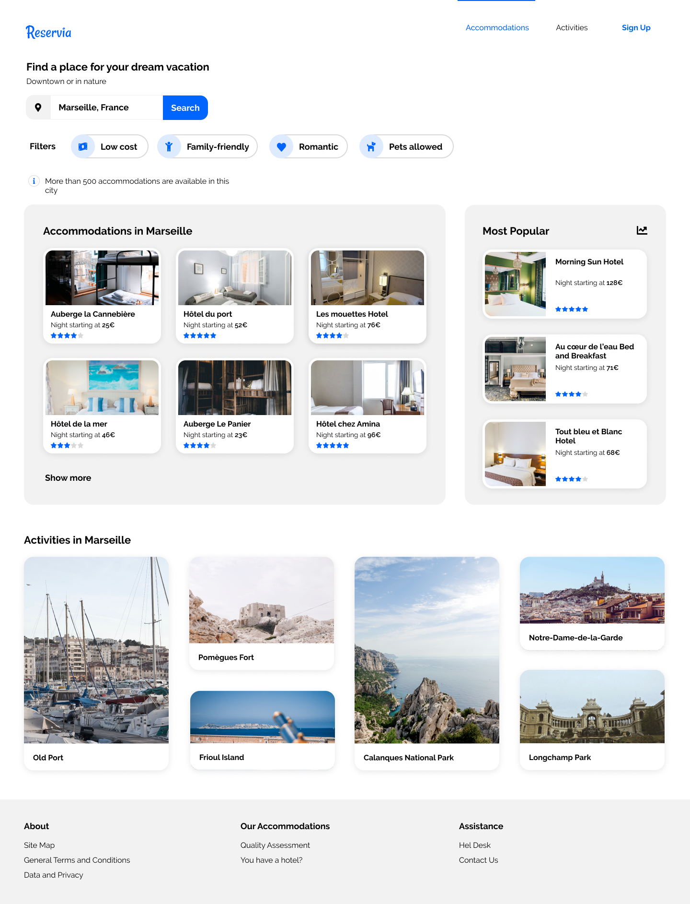

# Tutorial "From mockup to HTML / Css page!".

 Done with Openclassrooms' frontend developer path: https://openclassrooms.com/

I was given a couple of pictures of a mockup website and was tasked to code it from scratch! Here's the result.

